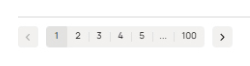

# Решение тестового задания №1 для стажёра QA-направления (зимняя волна 2025)

## Contents

1. [Задание 1](#задание-1)  
2. [Решение](#решение)  
  2.1 [Баг №1](#баг-№1) На шапке сайта отображается текст с орфографической ошибкой "Все категори".  
  2.2 [Баг №2](#баг-№2) В боковой панели фильтров для категорий 'Хобби и отдых/Велосипеды/Горные' перечень брендов отображается не по алфавиту.  
  2.3 [Баг №3](#баг-№3) Не работает кнопка выбора способа отображения "На карте" - объявления отображаются в виде "плиток" (по-умолчанию).  
  2.4 [Баг №4](#баг-№4) При выборе варианта сортировки "Дороже" порядок отображения объявлений не корректный.  
  2.5 [Баг №5](#баг-№5) В выдаче предложений "Горные велосипеды бренда Author в Москве" отображается карточка объявления с "велосипед Atom из Липецка" при включенном переключателе "Сначала в Москве".  
  2.6 [Баг №6](#баг-№6) Отсутствует цена в карточке объявления "велосипед Atom из Липецка".  
  2.7 [Баг №7](#баг-№7) В выдаче предложений "Горные велосипеды бренда Author в Москве" отображаются объявления с указанием несуществующих в Москве станций метро.  
  2.8 [Баг №8](#баг-№8) В нижней части сайта количество страниц с объявлениями больше, чем количество найденных предложений.   
  2.9 [Баг №9](#баг-№9) Карточка с объявлением "велосипед Atom из Липецка" расположена ниже остальных.  
  2.10 [Баг №10](#баг-№10) Уведомление об ошибке не соответствует стандартам UX/UI: малозаметно, не информативно и расположено не по центру.   
  2.11 [Баг №11](#баг-№11) На кнопке, которая подтверждает выбранные фильтры, отображается некорректное количество найденных объявлений.  

# Задание 1
Перед вами скриншот страницы Авито с результатами поиска. Изучите его, перечислите все имеющиеся баги, и укажите их приоритет (High, medium, low).  
  
<b>*Скриншот страницы Авито с результатами поиска*</b>

<!-- [High/medium/low] -->

# 2. Решение

  
<b>*Числа указывают на порядковый номер бага*</b>  

## Баг №1
### На шапке сайта отображается текст с орфографической ошибкой "Все категори".
  - **Описание:** Не отображается последняя буква в тексте кнопки "Все категории"
  - **Приоритет:** High
  - **Обоснование приоритета:** 
    - опечатка на шапке сайта, которая бросается в глаза и способна повлиять на репутацию компании;
  <!-- - Скриншот:  
    
  <b>*Опечатка в слове категории*</b>   -->
  [Вернуться к оглавлению](#contents)

## Баг №2
###  В боковой панели фильтров для категорий 'Хобби и отдых/Велосипеды/Горные' перечень брендов отображается не по алфавиту.
  - **Описание:** В левой части страницы имеется функция фильтрации по брендам.  
    - Ожидаемое поведение: Отображается первые 6 наименований брендов, отсортированые по алфавиту.  
    - Фактический результат: Наименование брендов не отсортированы по алфавиту.
  - **Приоритет:** High  
  - **Обоснование приоритета:** не работает заявленный функционал.
  <!-- - Скриншот:  
    
  <b>*Отсортирован не по алфавиту*</b>   -->
  [Вернуться к оглавлению](#contents)

## Баг №3
###  Не работает кнопка выбора способа отображения "На карте" - объявления отображаются в виде "плиток" (по-умолчанию).  
  - **Описание:** При выборе режима отображения объявлений "На карте" система вместо отображения на карте показывает их в виде "плиток". Это нарушает ожидаемое поведение и делает невозможным использование карты для навигации по предложениям.  
    - Ожидаемое поведение: Отображается список объявлений на карте.  
    - Фактический результат: Отображается по-умолчанию в виде плиток. 
  - **Приоритет:** High
  - **Обоснование приоритета:**
    - Не работает заявленный функционал - нажатие на определенную кнопку не запускает саму функцию. 
    - Это блокирует прохождение сценария пользователем или сильно мешают ему. 
  <!-- - Скриншот:  
    
  <b>*Выбрана отображение на карте*</b>   -->
  [Вернуться к оглавлению](#contents)

## Баг №4
###  При выборе варианта сортировки "Дороже" порядок отображения объявлений не корректный.
  - **Описание:** На скриншоте видно, что выбрана сортировка "Дороже", но объявления отображаются без учёта выбранной сортировки. Например, сверху находится предложение за 17 500 руб., а ниже есть предложения за 29 990 руб.
    - Ожидаемый результат: Объявления должны отображаться в порядке убывания цены (от самой высокой к самой низкой).
    - Фактический результат: Объявления отображаются в неправильном порядке, что нарушает логику выбранной сортировки.
  - **Приоритет:** High  
  - **Обоснование приоритета:**
    - Ошибка критически влияет на пользовательский опыт, так как сортировка — это ключевая функция для поиска товаров.
    - Пользователи могут утратить доверие к платформе, если не смогут корректно находить нужные товары.
  <!-- - Скриншот:  
    
  <b>*На скриншоте видно, что выбрана сортировка "Дороже", но порядок объявлений не соответствует ожидаемому.*</b>   -->
  [Вернуться к оглавлению](#contents)

## Баг №5
###  В выдаче предложений "Горные велосипеды бренда Author в Москве" отображается карточка объявления с "велосипед Atom из Липецка" при включенном переключателе "Сначала в Москве".
  - **Описание:** Некорректная работа переключателя "Сначала из Москвы". 
    - Ожидаемое поведение: Система отображает карточки объявлений, соответствующие запросу: горные велосипеды бренда Author, расположенные в Москве, с указанием цены. Отображаться должны сначала объявления из Москвы.
    - Фактический результат: в выдачу попала 1 не релевантное объявление.   
  - **Приоритет:** low
  - **Обоснование приоритета:**
    - редкость проявления дефекта,
    - сложность воспроизведения для юзеров.
  <!-- - Скриншот:  
    
  <b>*Не релевантная выдача объявления из Липецкой области.*</b>   -->
  - **Примечание:** Так же важно отметить, что в выдачу попал товар с брендом "Atom", но у нас недостаточно информации. Возможно, это не ошибка, а просто пользователь при оформлений объявления в графе бренд указал "Author" и поэтому товар попал в данную выдачу. Тогда это ошибка модераций. Объявления с подобной ошибкой наблюдаются и в текущей версии сайта Авито.  
  [Вернуться к оглавлению](#contents)

## Баг №6
###  Отсутствует цена в карточке объявления "велосипед Atom из Липецка".  
  - **Описание:** В выдаче предложений "Горные велосипеды бренда Author в Москве" отображается 1 карточка с не релевантным объявлением - "велосипед Atom из Липецка", у которой не отображается цена.
    - Ожидаемое поведение: При отсутствии цены, должна отображаться надпись: "Цена не указана"
    - Фактический результат: Нет ни цены, ни надписи о том, что "Цена не указана"  
  - **Приоритет:** low
  - **Обоснование приоритета:**
    - редкость проявления дефекта,
    - сложность воспроизведения для юзеров.  
  [Вернуться к оглавлению](#contents)

## Баг №7
###  В выдаче предложений "Горные велосипеды бренда Author в Москве" отображаются объявления с указанием несуществующих в Москве станций метро.  
  - **Описание:** В выдаче присутсвуют объявления у которых отображаются не существующие станции:
    - Звенигородская станция - еще строится.
    - Ховин - станции с таким наименованием нет, но есть станция Ховрино.
  - **Приоритет:** High
  - **Обоснование приоритета:**
    - Это может ввести пользователей в заблуждение и ухудшить их опыт взаимодействия с платформой.
    - Ошибка может привести к потере потенциальных клиентов, если они решат, что платформа ненадёжная.
    - Ошибка встретилась более 1 раза.
  <!-- - Скриншот:  
    
  <b>*Звенигородская станция - еще строится.*</b>  
    
  <b>*Есть станция Ховрино, но не Ховин*</b>   -->
  [Вернуться к оглавлению](#contents)

## Баг №8
###  В нижней части сайта количество страниц с объявлениями больше, чем количество найденных предложений.  
  - **Описание:** На 1 странице 12 карточек, найдено 61 объявление. Но возможно, что это количесвто объявлений отображается не корректно.
    - Ожидаемый результат: Должно быть не более 6 страниц.
    - Фактический результат: 100 страниц.
  - **Приоритет:** medium
  - **Обоснование приоритета:**
    - Ошибка серьезная так как влияет на навигацию, но пользователь редко листает до самого низа и тем более дальше 3й страницы.  
  <!-- - Скриншот:  
    
  <b>*Страниц больше чем найдено объявлений (61)*</b>   -->
  [Вернуться к оглавлению](#contents)

## Баг №9
###  Карточка с объявлением "велосипед Atom из Липецка" расположена ниже остальных.  
  - **Описание:** В режиме отображения в виде плиток одна из карточек с объявлением расположена ниже остальных, что нарушает визуальную целостность сетки.  
  - **Приоритет:** low
  - **Обоснование приоритета:** 
    - это не влияет на функциональность, но все же в небольшой степени не соответствует стандартам.
    - косметическая ошибка.
  <!-- - Скриншот:  
    
  <b>*Страниц больше чем найдено объявлений (61)*</b>   -->
  [Вернуться к оглавлению](#contents)

## Баг №10
###  Уведомление об ошибке не соответствует стандартам UX/UI: малозаметно, не информативно и расположено не по центру.   
  - **Описание:** По текущему сообщению не понятно о какой ошибке идет речь, и само уведомление не сразу можно заметить.
  - **Приоритет:** medium
  - **Обоснование приоритета:**
    - Не критично влияет на основной сценарий. 
  <!-- - Скриншот:  
    
  <b>*Страниц больше чем найдено объявлений (61)*</b>   -->
  [Вернуться к оглавлению](#contents)

## Баг №11
###  На кнопке, которая подтверждает выбранные фильтры, отображается некорректное количество найденных объявлений.  
  - **Описание:** В боковой панели включены два фильтра: по бренду и по цене (до 90000 руб). В выдаче уже отображаются предложения "Горные велосипеды бренда Author в Москве". Следовательно, количество найденных объявлений (9 штук) расчитано с учетом фильтра по цене (до 90000 руб). Но у нас уже на первой странице 11 объявлений, которые по цене ниже 90000 руб (без учета товара из Липецка). 
  - **Приоритет:** medium
  - **Обоснование приоритета:**
    - Не критично влияет на основной сценарий.  
  [Вернуться к оглавлению](#contents)

## Баг №12
### Некорректно отображается местоположение продавца - указано что от метро Трикотажная потребуется пешком пройти 10-15 часов.   
  - **Описание:** В одном объявлений (см. скрин) отображается время пешей доступности от метро 10-15 часов. В подобных случаях должен отображаться просто район. 
  - **Приоритет:** low
  - **Обоснование приоритета:** 
    - это не влияет на функциональность, но все же в небольшой степени не соответствует стандартам. 
    - редкость проявления дефекта (1 из 12). 
  [Вернуться к оглавлению](#contents)

<!-- Хотим поделиться советами о том, как лучше выполнять подобные задания:
Определите главную функциональность страницы. Что может быть главной функциональностью на странице с поиском объявлений?
Поиск по тексту.
Работа фильтров.
Выдача объявлений.
Посмотрите на внешний вид. Вам необходимо убедиться, что на странице нет багов, которые могут испортить репутацию компании.
Определите приоритеты. Чтобы проверить себя, руководствуйтесь разделом priority/severity в ISTQB. -->